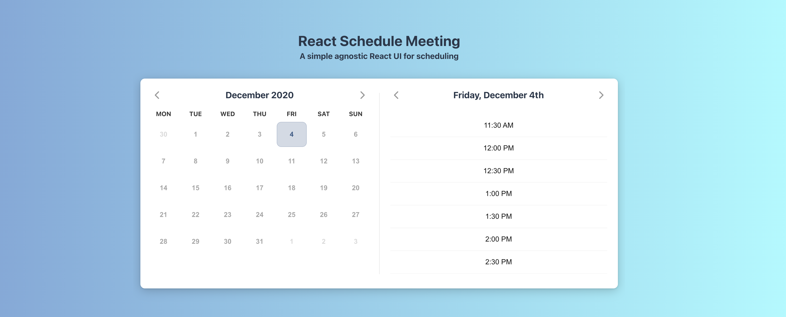

# React Schedule Meeting



[Example & Documentation](https://react-schedule-meeting.netlify.app)

## Installation:

```
npm i react-schedule-meeting
```

or

```
yarn add react-schedule-meeting
```

## Motivation

We wanted a UI that was agnostic to any scheduling logic after the user has selected their slot. The intention is to have an extremely simple component that accepts available time slots and returns a selected time slot.

## Usage Flow Overview

1. Pass in an array of date ranges that are available for meetings
1. The ScheduleMeeting component will split them into start times based on the event duration prop
1. When a user confirms a start time, the component returns:
   - The start time selected 
   - The original time slot that was used
   - The original time slot now split into two separate time slots _(in case you need to keep track of availabilities)_

[Example & Documentation](https://react-schedule-meeting.netlify.app)